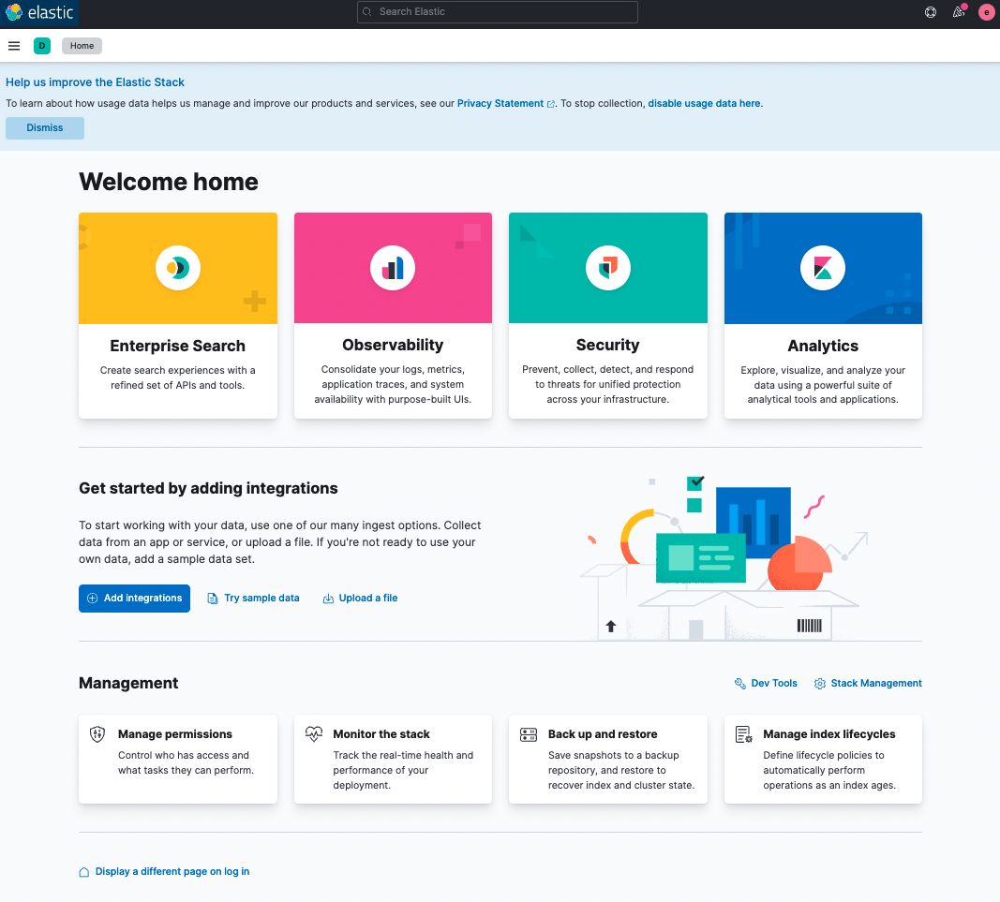
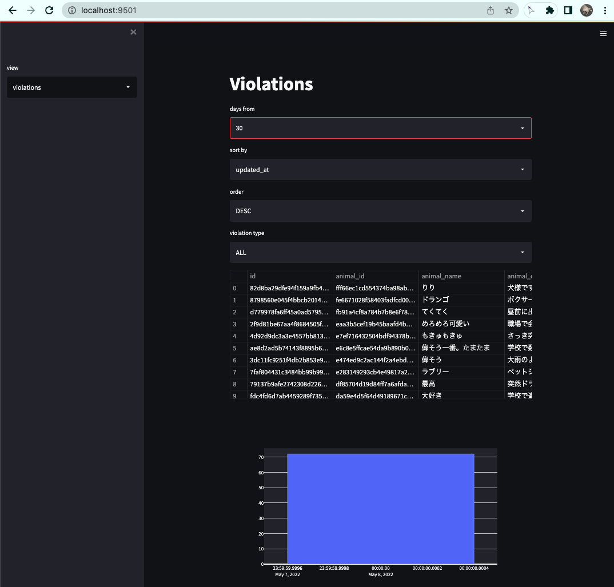
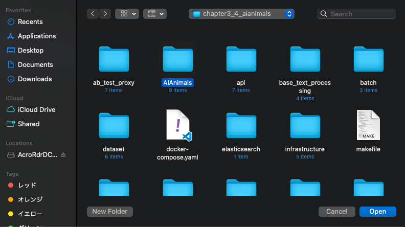
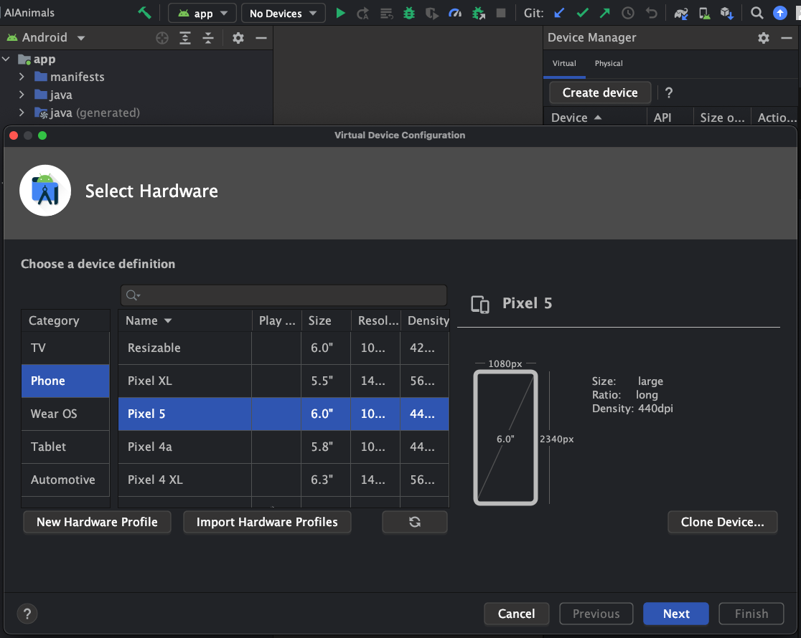
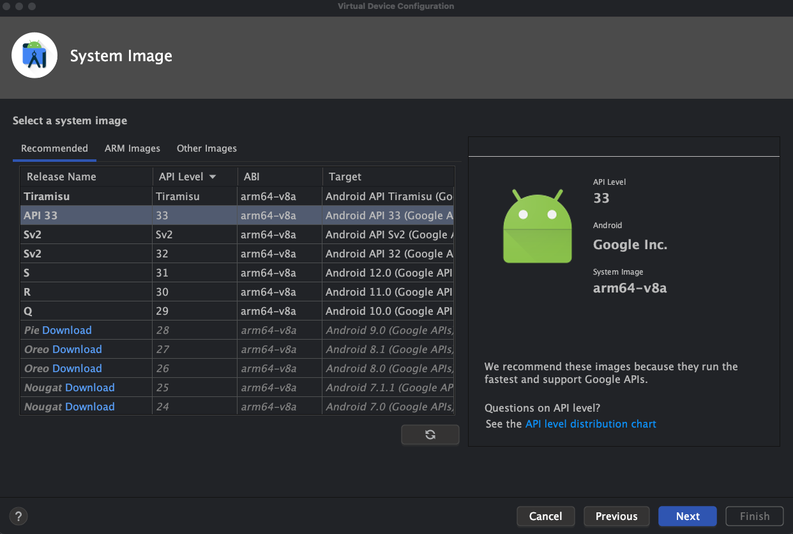
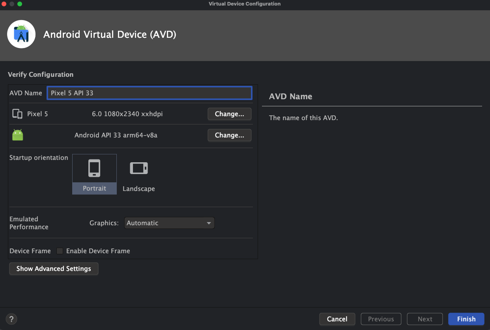
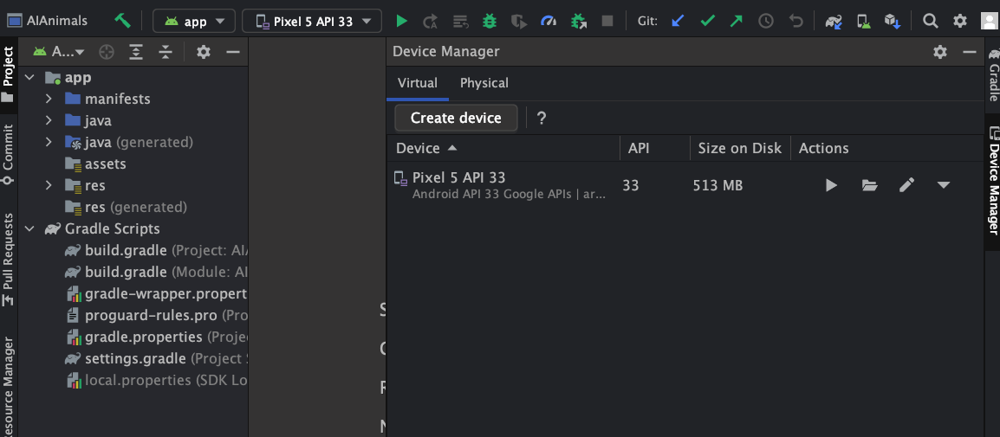
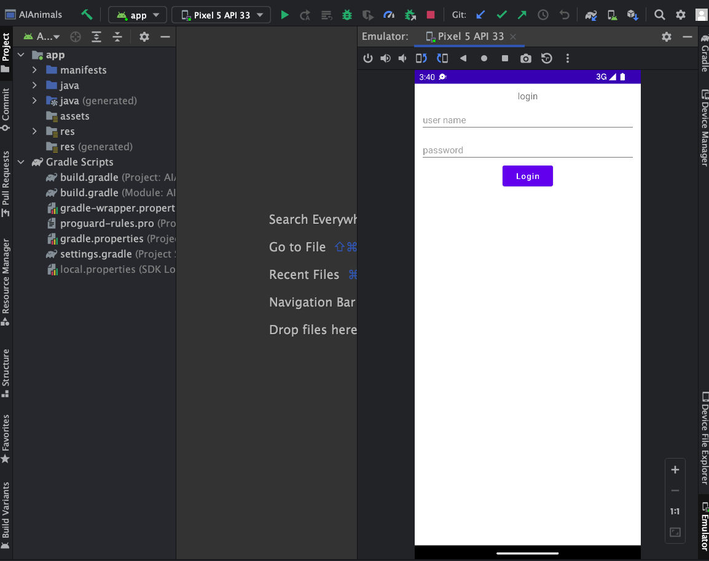
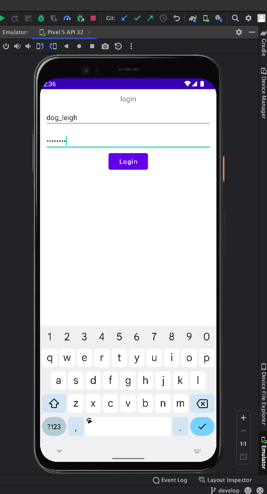
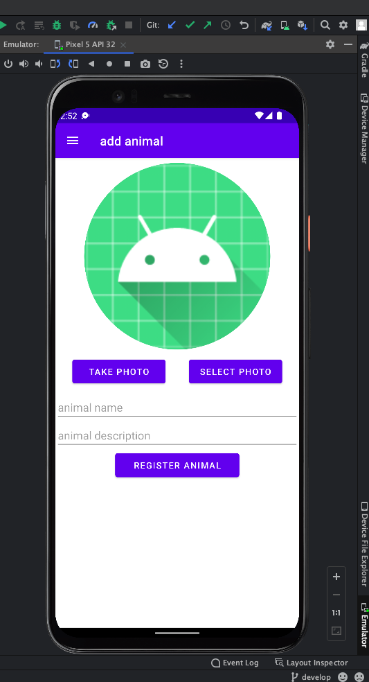

# Chapter3 and 4 AIAnimals

本READMEはAIAnimalsという架空のスマホアプリおよびバックエンド基盤を構築し、活用する方法を説明します。
スマホはAndroidで開発しています。スマホアプリを起動するためにはAndroid Studioが必要です。
バックエンド基盤はDocker composeまたはKubernetesクラスターで起動することができます。
ただしDocker composeで起動する場合、機械学習関連のコンポーネントを起動することができないので、ご注意ください。

## Components

TODO:　後で書くかも

## Requirements

- Android Studio
- [Docker Engine](https://docs.docker.com/engine/install/)
- [Docker compose](https://docs.docker.jp/compose/install.html)
- [Kubernetes](https://kubernetes.io/ja/)
  - Kubernetesクラスターではノードの合計で48cpu以上, 128GB以上のメモリが必要になります。
- makeコマンドの実行環境
- [kubectl](https://kubernetes.io/ja/docs/tasks/tools/install-kubectl/)の実行環境
  - kubectlは[公式ドキュメント](https://kubernetes.io/ja/docs/tasks/tools/install-kubectl/)からインストールしてください。
- [argo cli](https://github.com/argoproj/argo-workflows/releases)の実行環境
  - argo cliは[公式ドキュメント](https://github.com/argoproj/argo-workflows/releases)からインストールしてください。


## Getting started ~ バックエンド共通 ~

バックエンドはDocker composeまたはKubernetesクラスターで稼働させることができます。
以下ではDocker composeおよびKubernetesクラスター共通の手順を説明します。

### 1. Dockerイメージのビルド

- バックエンドで使うDockerイメージをビルドします。
- ビルドコマンドは `make build_all` です。
- なお、ビルド済みのDockerイメージは以下に用意されています。
  - https://hub.docker.com/repository/docker/shibui/building-ml-system/general
  - `make pull_all` でDockerイメージを取得することができます。

<details> <summary>Docker buildのログ</summary>

```sh
$ make build_all
docker build \
		--platform x86_64 \
		-t shibui/building-ml-system:ai_animals_k8s_client_0.0.0 \
		-f ~/building-ml-system/chapter3_4_aianimals/infrastructure/k8s_client/Dockerfile \
		.
[+] Building 2.0s (7/7) FINISHED
 => [internal] load build definition from Dockerfile                                                                           0.0s
 => => transferring dockerfile: 484B                                                                                           0.0s
 => [internal] load .dockerignore                                                                                              0.0s
 => => transferring context: 2B                                                                                                0.0s
 => [internal] load metadata for docker.io/library/python:3.9.7-slim                                                           2.0s
 => [auth] library/python:pull token for registry-1.docker.io                                                                  0.0s
 => [1/2] FROM docker.io/library/python:3.9.7-slim@sha256:aef632387d994b410de020dfd08fb1d9b648fc8a5a44f332f7ee326c8e170dba     0.0s
 => CACHED [2/2] RUN apt-get -y update &&     apt-get -y install curl &&     rm -rf /var/lib/apt/lists/* &&     curl -LO "htt  0.0s
 => exporting to image                                                                                                         0.0s
 => => exporting layers                                                                                                        0.0s
 => => writing image sha256:efc24a5246b931f6c97ebcfd98d2fa61cee890a2c4710ba86dc62c8a034c9df0                                   0.0s
 => => naming to docker.io/shibui/building-ml-system:ai_animals_k8s_client_0.0.0                                               0.0s

Use 'docker scan' to run Snyk tests against images to find vulnerabilities and learn how to fix them
docker build \
		--platform x86_64 \
		-t shibui/building-ml-system:ai_animals_model_loader_0.0.0 \
		-f ~/building-ml-system/chapter3_4_aianimals/model_loader/Dockerfile \
		.
[+] Building 0.4s (10/10) FINISHED
 => [internal] load build definition from Dockerfile                                                                           0.0s
 => => transferring dockerfile: 459B                                                                                           0.0s
 => [internal] load .dockerignore                                                                                              0.0s
 => => transferring context: 2B                                                                                                0.0s
 => [internal] load metadata for docker.io/library/python:3.9.7-slim                                                           0.3s
 => [1/5] FROM docker.io/library/python:3.9.7-slim@sha256:aef632387d994b410de020dfd08fb1d9b648fc8a5a44f332f7ee326c8e170dba     0.0s
 => [internal] load build context                                                                                              0.0s
 => => transferring context: 11.19kB                                                                                           0.0s
 => CACHED [2/5] WORKDIR /opt                                                                                                  0.0s
 => CACHED [3/5] COPY model_loader/requirements.txt /opt/                                                                      0.0s
 => CACHED [4/5] RUN apt-get -y update &&     apt-get -y install     apt-utils     gcc &&     apt-get clean &&     rm -rf /va  0.0s
 => CACHED [5/5] COPY model_loader/src/ /opt/src/                                                                              0.0s
 => exporting to image                                                                                                         0.0s
 => => exporting layers                                                                                                        0.0s
 => => writing image sha256:a5822ae7537a6cc4c017e85bcf5fb03d0830f845bd7db7f8301f0c69ec29c87e                                   0.0s
 => => naming to docker.io/shibui/building-ml-system:ai_animals_model_loader_0.0.0                                             0.0s

Use 'docker scan' to run Snyk tests against images to find vulnerabilities and learn how to fix them
docker build \
		--platform x86_64 \
		-t shibui/building-ml-system:ai_animals_mlflow_0.0.0 \
		-f ~/building-ml-system/chapter3_4_aianimals/mlflow/Dockerfile \
		.
[+] Building 0.4s (7/7) FINISHED
 => [internal] load build definition from Dockerfile                                                                           0.0s
 => => transferring dockerfile: 367B                                                                                           0.0s
 => [internal] load .dockerignore                                                                                              0.0s
 => => transferring context: 2B                                                                                                0.0s
 => [internal] load metadata for docker.io/library/python:3.9-slim                                                             0.3s
 => [1/3] FROM docker.io/library/python:3.9-slim@sha256:ea93ec4fbe8ee1c62397410c0d1f342a33199e98cd59adac6964b38e410e8246       0.0s
 => CACHED [2/3] WORKDIR /opt                                                                                                  0.0s
 => CACHED [3/3] RUN pip install mlflow sqlalchemy psycopg2-binary google-cloud-storage azure-storage-blob boto3               0.0s
 => exporting to image                                                                                                         0.0s
 => => exporting layers                                                                                                        0.0s
 => => writing image sha256:07d9f4d94bc86cd061f2f1ae72cf9ea9836aacface840b1e4d3039f68966010e                                   0.0s
 => => naming to docker.io/shibui/building-ml-system:ai_animals_mlflow_0.0.0                                                   0.0s

Use 'docker scan' to run Snyk tests against images to find vulnerabilities and learn how to fix them
docker build \
		--platform x86_64 \
		-t shibui/building-ml-system:ai_animals_base_text_processing_0.0.0 \
		-f ~/building-ml-system/chapter3_4_aianimals/base_text_processing/Dockerfile \
		.
[+] Building 0.4s (9/9) FINISHED
 => [internal] load build definition from Dockerfile                                                                           0.0s
 => => transferring dockerfile: 924B                                                                                           0.0s
 => [internal] load .dockerignore                                                                                              0.0s
 => => transferring context: 2B                                                                                                0.0s
 => [internal] load metadata for docker.io/library/python:3.9.7-slim                                                           0.3s
 => [1/4] FROM docker.io/library/python:3.9.7-slim@sha256:aef632387d994b410de020dfd08fb1d9b648fc8a5a44f332f7ee326c8e170dba     0.0s
 => [internal] load build context                                                                                              0.0s
 => => transferring context: 899B                                                                                              0.0s
 => CACHED [2/4] WORKDIR /opt                                                                                                  0.0s
 => CACHED [3/4] COPY base_text_processing/requirements.txt /opt/                                                              0.0s
 => CACHED [4/4] RUN apt-get -y update &&     apt-get -y install     apt-utils     gcc     git     curl     file     sudo      0.0s
 => exporting to image                                                                                                         0.0s
 => => exporting layers                                                                                                        0.0s
 => => writing image sha256:e8cf071c6f0bbac8cd5b4dfa6966361e9f26469f1e9113172ba77d4f641e3700                                   0.0s
 => => naming to docker.io/shibui/building-ml-system:ai_animals_base_text_processing_0.0.0                                     0.0s

Use 'docker scan' to run Snyk tests against images to find vulnerabilities and learn how to fix them
docker build \
		--platform x86_64 \
		--build-arg FROM_IMAGE=shibui/building-ml-system:ai_animals_base_text_processing_0.0.0 \
		-t shibui/building-ml-system:ai_animals_data_registry_0.0.0 \
		-f ~/building-ml-system/chapter3_4_aianimals/batch/data_registry/Dockerfile \
		.
[+] Building 0.1s (10/10) FINISHED
 => [internal] load build definition from Dockerfile                                                                           0.0s
 => => transferring dockerfile: 524B                                                                                           0.0s
 => [internal] load .dockerignore                                                                                              0.0s
 => => transferring context: 2B                                                                                                0.0s
 => [internal] load metadata for docker.io/shibui/building-ml-system:ai_animals_base_text_processing_0.0.0                     0.0s
 => [internal] load build context                                                                                              0.0s
 => => transferring context: 141.16kB                                                                                          0.0s
 => [1/5] FROM docker.io/shibui/building-ml-system:ai_animals_base_text_processing_0.0.0                                       0.0s
 => CACHED [2/5] WORKDIR /opt                                                                                                  0.0s
 => CACHED [3/5] COPY batch/data_registry/requirements.txt /opt/                                                               0.0s
 => CACHED [4/5] RUN apt-get -y update &&     apt-get -y install     apt-utils     gcc     curl     wget &&     apt-get clean  0.0s
 => CACHED [5/5] COPY batch/data_registry/src/ /opt/src/                                                                       0.0s
 => exporting to image                                                                                                         0.0s
 => => exporting layers                                                                                                        0.0s
 => => writing image sha256:8d6f470eea896b1ef837a3a287fe2294ee04f12ea3d657cba6f45e73abcee63c                                   0.0s
 => => naming to docker.io/shibui/building-ml-system:ai_animals_data_registry_0.0.0                                            0.0s

Use 'docker scan' to run Snyk tests against images to find vulnerabilities and learn how to fix them
docker build \
		--platform x86_64 \
		--build-arg FROM_IMAGE=shibui/building-ml-system:ai_animals_base_text_processing_0.0.0 \
		-t shibui/building-ml-system:ai_animals_feature_registry_0.0.0 \
		-f ~/building-ml-system/chapter3_4_aianimals/batch/feature_registry/Dockerfile \
		.
[+] Building 0.1s (11/11) FINISHED
 => [internal] load build definition from Dockerfile                                                                           0.0s
 => => transferring dockerfile: 539B                                                                                           0.0s
 => [internal] load .dockerignore                                                                                              0.0s
 => => transferring context: 2B                                                                                                0.0s
 => [internal] load metadata for docker.io/shibui/building-ml-system:ai_animals_base_text_processing_0.0.0                     0.0s
 => [1/6] FROM docker.io/shibui/building-ml-system:ai_animals_base_text_processing_0.0.0                                       0.0s
 => [internal] load build context                                                                                              0.0s
 => => transferring context: 80.66kB                                                                                           0.0s
 => CACHED [2/6] WORKDIR /opt                                                                                                  0.0s
 => CACHED [3/6] COPY batch/feature_registry/requirements.txt /opt/                                                            0.0s
 => CACHED [4/6] RUN apt-get -y update &&     apt-get -y install     apt-utils     gcc     curl     wget &&     apt-get clean  0.0s
 => CACHED [5/6] COPY batch/feature_registry/src/ /opt/src/                                                                    0.0s
 => CACHED [6/6] COPY batch/feature_registry/hydra/ /opt/hydra/                                                                0.0s
 => exporting to image                                                                                                         0.0s
 => => exporting layers                                                                                                        0.0s
 => => writing image sha256:27cf6cc4d509958ae3f1ce02e7408c00247926bfd024db07cfa5213b0631e456                                   0.0s
 => => naming to docker.io/shibui/building-ml-system:ai_animals_feature_registry_0.0.0                                         0.0s

Use 'docker scan' to run Snyk tests against images to find vulnerabilities and learn how to fix them
docker build \
		--platform x86_64 \
		-t shibui/building-ml-system:ai_animals_api_0.0.0 \
		-f ~/building-ml-system/chapter3_4_aianimals/api/Dockerfile \
		.
[+] Building 0.4s (12/12) FINISHED
 => [internal] load build definition from Dockerfile                                                                           0.0s
 => => transferring dockerfile: 554B                                                                                           0.0s
 => [internal] load .dockerignore                                                                                              0.0s
 => => transferring context: 2B                                                                                                0.0s
 => [internal] load metadata for docker.io/library/python:3.9.7-slim                                                           0.3s
 => [1/7] FROM docker.io/library/python:3.9.7-slim@sha256:aef632387d994b410de020dfd08fb1d9b648fc8a5a44f332f7ee326c8e170dba     0.0s
 => [internal] load build context                                                                                              0.0s
 => => transferring context: 166.97kB                                                                                          0.0s
 => CACHED [2/7] WORKDIR /opt                                                                                                  0.0s
 => CACHED [3/7] COPY api/requirements.txt /opt/                                                                               0.0s
 => CACHED [4/7] RUN apt-get -y update &&     apt-get -y install     apt-utils     gcc &&     apt-get clean &&     rm -rf /va  0.0s
 => CACHED [5/7] COPY api/src/ /opt/src/                                                                                       0.0s
 => CACHED [6/7] COPY api/run.sh /opt/run.sh                                                                                   0.0s
 => CACHED [7/7] RUN chmod +x /opt/run.sh                                                                                      0.0s
 => exporting to image                                                                                                         0.0s
 => => exporting layers                                                                                                        0.0s
 => => writing image sha256:7902831798775161ae430f5daceefe4600f885a3972acb3bc8ca6cd9b1ee3333                                   0.0s
 => => naming to docker.io/shibui/building-ml-system:ai_animals_api_0.0.0                                                      0.0s

Use 'docker scan' to run Snyk tests against images to find vulnerabilities and learn how to fix them
docker build \
		--platform x86_64 \
		-t shibui/building-ml-system:ai_animals_ab_test_proxy_0.0.0 \
		-f ~/building-ml-system/chapter3_4_aianimals/ab_test_proxy/Dockerfile \
		.
[+] Building 0.4s (13/13) FINISHED
 => [internal] load build definition from Dockerfile                                                                           0.0s
 => => transferring dockerfile: 645B                                                                                           0.0s
 => [internal] load .dockerignore                                                                                              0.0s
 => => transferring context: 2B                                                                                                0.0s
 => [internal] load metadata for docker.io/library/python:3.9.7-slim                                                           0.3s
 => [1/8] FROM docker.io/library/python:3.9.7-slim@sha256:aef632387d994b410de020dfd08fb1d9b648fc8a5a44f332f7ee326c8e170dba     0.0s
 => [internal] load build context                                                                                              0.0s
 => => transferring context: 26.08kB                                                                                           0.0s
 => CACHED [2/8] WORKDIR /opt                                                                                                  0.0s
 => CACHED [3/8] COPY ab_test_proxy/requirements.txt /opt/                                                                     0.0s
 => CACHED [4/8] RUN apt-get -y update &&     apt-get -y install     apt-utils     gcc &&     apt-get clean &&     rm -rf /va  0.0s
 => CACHED [5/8] COPY ab_test_proxy/src/ /opt/src/                                                                             0.0s
 => CACHED [6/8] COPY ab_test_proxy/ab_test_configurations/ /opt/ab_test_configurations/                                       0.0s
 => CACHED [7/8] COPY ab_test_proxy/run.sh /opt/run.sh                                                                         0.0s
 => CACHED [8/8] RUN chmod +x /opt/run.sh                                                                                      0.0s
 => exporting to image                                                                                                         0.0s
 => => exporting layers                                                                                                        0.0s
 => => writing image sha256:1e5a684c2c23a3eaabb8bdd5ef8862f3c244dc99490e270df7d4370b68c27749                                   0.0s
 => => naming to docker.io/shibui/building-ml-system:ai_animals_ab_test_proxy_0.0.0                                            0.0s

Use 'docker scan' to run Snyk tests against images to find vulnerabilities and learn how to fix them
docker build \
		-t shibui/building-ml-system:ai_animals_elasticsearch_0.0.0 \
		-f ~/building-ml-system/chapter3_4_aianimals/elasticsearch/Dockerfile \
		.
[+] Building 0.1s (7/7) FINISHED
 => [internal] load build definition from Dockerfile                                                                           0.0s
 => => transferring dockerfile: 198B                                                                                           0.0s
 => [internal] load .dockerignore                                                                                              0.0s
 => => transferring context: 2B                                                                                                0.0s
 => [internal] load metadata for docker.io/library/elasticsearch:8.1.3                                                         0.0s
 => [1/3] FROM docker.io/library/elasticsearch:8.1.3                                                                           0.0s
 => CACHED [2/3] RUN elasticsearch-plugin install analysis-kuromoji                                                            0.0s
 => CACHED [3/3] RUN elasticsearch-plugin install analysis-icu                                                                 0.0s
 => exporting to image                                                                                                         0.0s
 => => exporting layers                                                                                                        0.0s
 => => writing image sha256:3934a483a0d92882960b37b4cf803fac414c7580f112f2dcf18ec5102555d6df                                   0.0s
 => => naming to docker.io/shibui/building-ml-system:ai_animals_elasticsearch_0.0.0                                            0.0s

Use 'docker scan' to run Snyk tests against images to find vulnerabilities and learn how to fix them
docker build \
		--platform x86_64 \
		-t shibui/building-ml-system:ai_animals_violation_detection_no_animal_violation_proxy_0.0.0 \
		-f ~/building-ml-system/chapter3_4_aianimals/violation_detection/no_animal_violation/proxy/Dockerfile \
		.
[+] Building 0.4s (10/10) FINISHED
 => [internal] load build definition from Dockerfile                                                                           0.0s
 => => transferring dockerfile: 528B                                                                                           0.0s
 => [internal] load .dockerignore                                                                                              0.0s
 => => transferring context: 2B                                                                                                0.0s
 => [internal] load metadata for docker.io/library/python:3.9.7-slim                                                           0.3s
 => [1/5] FROM docker.io/library/python:3.9.7-slim@sha256:aef632387d994b410de020dfd08fb1d9b648fc8a5a44f332f7ee326c8e170dba     0.0s
 => [internal] load build context                                                                                              0.0s
 => => transferring context: 32.23kB                                                                                           0.0s
 => CACHED [2/5] WORKDIR /opt                                                                                                  0.0s
 => CACHED [3/5] COPY violation_detection/no_animal_violation/proxy/requirements.txt /opt/                                     0.0s
 => CACHED [4/5] RUN apt-get -y update &&     apt-get -y install     apt-utils     gcc &&     apt-get clean &&     rm -rf /va  0.0s
 => CACHED [5/5] COPY violation_detection/no_animal_violation/proxy/src/ /opt/src/                                             0.0s
 => exporting to image                                                                                                         0.0s
 => => exporting layers                                                                                                        0.0s
 => => writing image sha256:26fd5859c855131da894ae112e948eae5197d6b87efed0117ca1ce8ca484e708                                   0.0s
 => => naming to docker.io/shibui/building-ml-system:ai_animals_violation_detection_no_animal_violation_proxy_0.0.0            0.0s

Use 'docker scan' to run Snyk tests against images to find vulnerabilities and learn how to fix them
docker build \
		--platform x86_64 \
		-t shibui/building-ml-system:ai_animals_violation_detection_no_animal_violation_serving_0.0.0 \
		-f ~/building-ml-system/chapter3_4_aianimals/violation_detection/no_animal_violation/serving/Dockerfile \
		.
[+] Building 3.9s (10/10) FINISHED
 => [internal] load build definition from Dockerfile                                                                           0.0s
 => => transferring dockerfile: 541B                                                                                           0.0s
 => [internal] load .dockerignore                                                                                              0.0s
 => => transferring context: 2B                                                                                                0.0s
 => [internal] load metadata for docker.io/tensorflow/serving:2.8.0                                                            1.9s
 => [auth] tensorflow/serving:pull token for registry-1.docker.io                                                              0.0s
 => [1/4] FROM docker.io/tensorflow/serving:2.8.0@sha256:9ff5b146b74f4aca3ef88f607961ca400c53e19a808dc0d0df0197693bfd651e      0.0s
 => [internal] load build context                                                                                              2.0s
 => => transferring context: 69.51MB                                                                                           1.9s
 => CACHED [2/4] COPY violation_detection/no_animal_violation/serving/model/saved_model/ /no_animal_violation/saved_model/     0.0s
 => CACHED [3/4] COPY violation_detection/no_animal_violation/serving/tf_serving_entrypoint.sh /usr/bin/tf_serving_entrypoint  0.0s
 => CACHED [4/4] RUN chmod +x /usr/bin/tf_serving_entrypoint.sh                                                                0.0s
 => exporting to image                                                                                                         0.0s
 => => exporting layers                                                                                                        0.0s
 => => writing image sha256:fdcc627ece145679f96df94c7d156171ec48fd98d53fb0ef600b45892cf83bbb                                   0.0s
 => => naming to docker.io/shibui/building-ml-system:ai_animals_violation_detection_no_animal_violation_serving_0.0.0          0.0s

Use 'docker scan' to run Snyk tests against images to find vulnerabilities and learn how to fix them
docker build \
		--platform x86_64 \
		-t shibui/building-ml-system:ai_animals_violation_detection_registry_0.0.0 \
		-f ~/building-ml-system/chapter3_4_aianimals/violation_detection/registry/Dockerfile \
		.
[+] Building 0.4s (10/10) FINISHED
 => [internal] load build definition from Dockerfile                                                                           0.0s
 => => transferring dockerfile: 511B                                                                                           0.0s
 => [internal] load .dockerignore                                                                                              0.0s
 => => transferring context: 2B                                                                                                0.0s
 => [internal] load metadata for docker.io/library/python:3.9.7-slim                                                           0.3s
 => [1/5] FROM docker.io/library/python:3.9.7-slim@sha256:aef632387d994b410de020dfd08fb1d9b648fc8a5a44f332f7ee326c8e170dba     0.0s
 => [internal] load build context                                                                                              0.0s
 => => transferring context: 32.88kB                                                                                           0.0s
 => CACHED [2/5] WORKDIR /opt                                                                                                  0.0s
 => CACHED [3/5] COPY violation_detection/registry/requirements.txt /opt/                                                      0.0s
 => CACHED [4/5] RUN apt-get -y update &&     apt-get -y install     apt-utils     gcc &&     apt-get clean &&     rm -rf /va  0.0s
 => CACHED [5/5] COPY violation_detection/registry/src/ /opt/src/                                                              0.0s
 => exporting to image                                                                                                         0.0s
 => => exporting layers                                                                                                        0.0s
 => => writing image sha256:2388b28a3bc2cd09fb839bfe3a6a26841fc2c42f06ca9d8efce6c1f1d2f9affc                                   0.0s
 => => naming to docker.io/shibui/building-ml-system:ai_animals_violation_detection_registry_0.0.0                             0.0s

Use 'docker scan' to run Snyk tests against images to find vulnerabilities and learn how to fix them
docker build \
		--platform x86_64 \
		-t shibui/building-ml-system:ai_animals_violation_detection_no_animal_violation_train_0.0.0 \
		-f ~/building-ml-system/chapter3_4_aianimals/violation_detection/model_development/no_animal_violation/Dockerfile \
		.
[+] Building 0.5s (12/12) FINISHED
 => [internal] load build definition from Dockerfile                                                                           0.0s
 => => transferring dockerfile: 598B                                                                                           0.0s
 => [internal] load .dockerignore                                                                                              0.0s
 => => transferring context: 2B                                                                                                0.0s
 => [internal] load metadata for docker.io/library/python:3.9.7-slim                                                           0.3s
 => [1/7] FROM docker.io/library/python:3.9.7-slim@sha256:aef632387d994b410de020dfd08fb1d9b648fc8a5a44f332f7ee326c8e170dba     0.0s
 => [internal] load build context                                                                                              0.1s
 => => transferring context: 2.66MB                                                                                            0.1s
 => CACHED [2/7] WORKDIR /opt                                                                                                  0.0s
 => CACHED [3/7] COPY violation_detection/model_development/no_animal_violation/requirements.txt /opt/                         0.0s
 => CACHED [4/7] RUN apt-get -y update &&     apt-get -y install     apt-utils     gcc &&     apt-get clean &&     rm -rf /va  0.0s
 => CACHED [5/7] COPY violation_detection/model_development/no_animal_violation/src/ /opt/src/                                 0.0s
 => CACHED [6/7] COPY violation_detection/model_development/no_animal_violation/hydra/ /opt/hydra/                             0.0s
 => CACHED [7/7] COPY violation_detection/model_development/no_animal_violation/data/ /opt/data/                               0.0s
 => exporting to image                                                                                                         0.0s
 => => exporting layers                                                                                                        0.0s
 => => writing image sha256:d229af1514a90afa1786a50efd9f299d27806bd47ff8452f64c5cb924de5c381                                   0.0s
 => => naming to docker.io/shibui/building-ml-system:ai_animals_violation_detection_no_animal_violation_train_0.0.0            0.0s

Use 'docker scan' to run Snyk tests against images to find vulnerabilities and learn how to fix them
docker build \
		--platform x86_64 \
		--build-arg FROM_IMAGE=shibui/building-ml-system:ai_animals_base_text_processing_0.0.0 \
		-t shibui/building-ml-system:ai_animals_search_learn_to_rank_train_0.0.0 \
		-f ~/building-ml-system/chapter3_4_aianimals/search/model_development/learn_to_rank/Dockerfile \
		.
[+] Building 0.1s (11/11) FINISHED
 => [internal] load build definition from Dockerfile                                                                           0.0s
 => => transferring dockerfile: 392B                                                                                           0.0s
 => [internal] load .dockerignore                                                                                              0.0s
 => => transferring context: 2B                                                                                                0.0s
 => [internal] load metadata for docker.io/shibui/building-ml-system:ai_animals_base_text_processing_0.0.0                     0.0s
 => [1/6] FROM docker.io/shibui/building-ml-system:ai_animals_base_text_processing_0.0.0                                       0.0s
 => [internal] load build context                                                                                              0.0s
 => => transferring context: 49.13kB                                                                                           0.0s
 => CACHED [2/6] WORKDIR /opt                                                                                                  0.0s
 => CACHED [3/6] COPY search/model_development/learn_to_rank/requirements.txt /opt/                                            0.0s
 => CACHED [4/6] RUN pip install --no-cache-dir -r requirements.txt                                                            0.0s
 => CACHED [5/6] COPY search/model_development/learn_to_rank/src/ /opt/src/                                                    0.0s
 => CACHED [6/6] COPY search/model_development/learn_to_rank/hydra/ /opt/hydra/                                                0.0s
 => exporting to image                                                                                                         0.0s
 => => exporting layers                                                                                                        0.0s
 => => writing image sha256:d4b9ff162acd526caa663543d94d39226da49c8c7d8338ccc9d45a9e040b24ec                                   0.0s
 => => naming to docker.io/shibui/building-ml-system:ai_animals_search_learn_to_rank_train_0.0.0                               0.0s

Use 'docker scan' to run Snyk tests against images to find vulnerabilities and learn how to fix them
docker build \
		--platform x86_64 \
		-t shibui/building-ml-system:ai_animals_search_similar_image_search_train_0.0.0 \
		-f ~/building-ml-system/chapter3_4_aianimals/search/model_development/similar_image_search/Dockerfile \
		.
[+] Building 0.4s (11/11) FINISHED
 => [internal] load build definition from Dockerfile                                                                           0.0s
 => => transferring dockerfile: 540B                                                                                           0.0s
 => [internal] load .dockerignore                                                                                              0.0s
 => => transferring context: 2B                                                                                                0.0s
 => [internal] load metadata for docker.io/library/python:3.9.7-slim                                                           0.3s
 => [1/6] FROM docker.io/library/python:3.9.7-slim@sha256:aef632387d994b410de020dfd08fb1d9b648fc8a5a44f332f7ee326c8e170dba     0.0s
 => [internal] load build context                                                                                              0.0s
 => => transferring context: 24.28kB                                                                                           0.0s
 => CACHED [2/6] WORKDIR /opt                                                                                                  0.0s
 => CACHED [3/6] COPY search/model_development/similar_image_search/requirements.txt /opt/                                     0.0s
 => CACHED [4/6] RUN apt-get -y update &&     apt-get -y install     apt-utils     gcc &&     apt-get clean &&     rm -rf /va  0.0s
 => CACHED [5/6] COPY search/model_development/similar_image_search/src/ /opt/src/                                             0.0s
 => CACHED [6/6] COPY search/model_development/similar_image_search/hydra/ /opt/hydra/                                         0.0s
 => exporting to image                                                                                                         0.0s
 => => exporting layers                                                                                                        0.0s
 => => writing image sha256:1d56b45ad6c1f8a911593cc24073297a171203fd42d0e8296fd2be21d480f58f                                   0.0s
 => => naming to docker.io/shibui/building-ml-system:ai_animals_search_similar_image_search_train_0.0.0                        0.0s

Use 'docker scan' to run Snyk tests against images to find vulnerabilities and learn how to fix them
docker build \
		--platform x86_64 \
		-t shibui/building-ml-system:ai_animals_search_similar_image_search_proxy_0.0.0 \
		-f ~/building-ml-system/chapter3_4_aianimals/search/similar_image_search/proxy/Dockerfile \
		.
[+] Building 0.4s (12/12) FINISHED
 => [internal] load build definition from Dockerfile                                                                           0.0s
 => => transferring dockerfile: 584B                                                                                           0.0s
 => [internal] load .dockerignore                                                                                              0.0s
 => => transferring context: 2B                                                                                                0.0s
 => [internal] load metadata for docker.io/library/python:3.9.7-slim                                                           0.3s
 => [1/7] FROM docker.io/library/python:3.9.7-slim@sha256:aef632387d994b410de020dfd08fb1d9b648fc8a5a44f332f7ee326c8e170dba     0.0s
 => [internal] load build context                                                                                              0.0s
 => => transferring context: 23.77kB                                                                                           0.0s
 => CACHED [2/7] WORKDIR /opt                                                                                                  0.0s
 => CACHED [3/7] COPY search/similar_image_search/proxy/requirements.txt /opt/                                                 0.0s
 => CACHED [4/7] RUN apt-get -y update &&     apt-get -y install     apt-utils     gcc &&     apt-get clean &&     rm -rf /va  0.0s
 => CACHED [5/7] COPY search/similar_image_search/proxy/src/ /opt/src/                                                         0.0s
 => CACHED [6/7] COPY search/similar_image_search/proxy/run.sh /opt/run.sh                                                     0.0s
 => CACHED [7/7] RUN chmod +x /opt/run.sh                                                                                      0.0s
 => exporting to image                                                                                                         0.0s
 => => exporting layers                                                                                                        0.0s
 => => writing image sha256:f23e2a9317cbd0c4c357103b67e86c4d39bb18a95ae30952b96750e3c906e2ef                                   0.0s
 => => naming to docker.io/shibui/building-ml-system:ai_animals_search_similar_image_search_proxy_0.0.0                        0.0s

Use 'docker scan' to run Snyk tests against images to find vulnerabilities and learn how to fix them
docker build \
		--platform x86_64 \
		--build-arg FROM_IMAGE=shibui/building-ml-system:ai_animals_base_text_processing_0.0.0 \
		-t shibui/building-ml-system:ai_animals_search_learn_to_rank_lgbm_api_0.0.0 \
		-f ~/building-ml-system/chapter3_4_aianimals/search/learn_to_rank/api/Dockerfile \
		.
[+] Building 0.1s (12/12) FINISHED
 => [internal] load build definition from Dockerfile                                                                           0.0s
 => => transferring dockerfile: 575B                                                                                           0.0s
 => [internal] load .dockerignore                                                                                              0.0s
 => => transferring context: 2B                                                                                                0.0s
 => [internal] load metadata for docker.io/shibui/building-ml-system:ai_animals_base_text_processing_0.0.0                     0.0s
 => [internal] load build context                                                                                              0.0s
 => => transferring context: 41.81kB                                                                                           0.0s
 => [1/7] FROM docker.io/shibui/building-ml-system:ai_animals_base_text_processing_0.0.0                                       0.0s
 => CACHED [2/7] WORKDIR /opt                                                                                                  0.0s
 => CACHED [3/7] COPY search/learn_to_rank/api/requirements.txt /opt/                                                          0.0s
 => CACHED [4/7] RUN apt-get -y update &&     apt-get -y install     apt-utils     gcc &&     apt-get clean &&     rm -rf /va  0.0s
 => CACHED [5/7] COPY search/learn_to_rank/api/src/ /opt/src/                                                                  0.0s
 => CACHED [6/7] COPY search/learn_to_rank/api/run.sh /opt/run.sh                                                              0.0s
 => CACHED [7/7] RUN chmod +x /opt/run.sh                                                                                      0.0s
 => exporting to image                                                                                                         0.0s
 => => exporting layers                                                                                                        0.0s
 => => writing image sha256:24cd3560265a4af7ed5226ae3d934e977b3dd7dae0a4fc961575128d4668d3ba                                   0.0s
 => => naming to docker.io/shibui/building-ml-system:ai_animals_search_learn_to_rank_lgbm_api_0.0.0                            0.0s

Use 'docker scan' to run Snyk tests against images to find vulnerabilities and learn how to fix them
docker build \
		--platform x86_64 \
		-t shibui/building-ml-system:ai_animals_violation_detection_portal_0.0.0 \
		-f ~/building-ml-system/chapter3_4_aianimals/violation_detection/portal/Dockerfile \
		.
[+] Building 0.4s (10/10) FINISHED
 => [internal] load build definition from Dockerfile                                                                           0.0s
 => => transferring dockerfile: 516B                                                                                           0.0s
 => [internal] load .dockerignore                                                                                              0.0s
 => => transferring context: 2B                                                                                                0.0s
 => [internal] load metadata for docker.io/library/python:3.9.7-slim                                                           0.3s
 => [1/5] FROM docker.io/library/python:3.9.7-slim@sha256:aef632387d994b410de020dfd08fb1d9b648fc8a5a44f332f7ee326c8e170dba     0.0s
 => [internal] load build context                                                                                              0.0s
 => => transferring context: 48.11kB                                                                                           0.0s
 => CACHED [2/5] WORKDIR /opt                                                                                                  0.0s
 => CACHED [3/5] COPY violation_detection/portal/requirements.txt /opt/                                                        0.0s
 => CACHED [4/5] RUN apt-get -y update &&     apt-get -y install     apt-utils     gcc &&     apt-get clean &&     rm -rf /va  0.0s
 => CACHED [5/5] COPY violation_detection/portal/src/ /opt/src/                                                                0.0s
 => exporting to image                                                                                                         0.0s
 => => exporting layers                                                                                                        0.0s
 => => writing image sha256:e6fcf571a3aa474216f559562d7d0bada406422307fff1267934d15e7757c4cb                                   0.0s
 => => naming to docker.io/shibui/building-ml-system:ai_animals_violation_detection_portal_0.0.0                               0.0s

Use 'docker scan' to run Snyk tests against images to find vulnerabilities and learn how to fix them
docker build \
		--platform x86_64 \
		--build-arg FROM_IMAGE=shibui/building-ml-system:ai_animals_base_text_processing_0.0.0 \
		-t shibui/building-ml-system:ai_animals_similar_word_registry_0.0.0 \
		-f ~/building-ml-system/chapter3_4_aianimals/batch/similar_word_registry/Dockerfile \
		.
[+] Building 0.1s (10/10) FINISHED
 => [internal] load build definition from Dockerfile                                                                           0.0s
 => => transferring dockerfile: 496B                                                                                           0.0s
 => [internal] load .dockerignore                                                                                              0.0s
 => => transferring context: 2B                                                                                                0.0s
 => [internal] load metadata for docker.io/shibui/building-ml-system:ai_animals_base_text_processing_0.0.0                     0.0s
 => [internal] load build context                                                                                              0.0s
 => => transferring context: 20.00kB                                                                                           0.0s
 => [1/5] FROM docker.io/shibui/building-ml-system:ai_animals_base_text_processing_0.0.0                                       0.0s
 => CACHED [2/5] WORKDIR /opt                                                                                                  0.0s
 => CACHED [3/5] COPY batch/similar_word_registry/requirements.txt /opt/                                                       0.0s
 => CACHED [4/5] RUN apt-get -y update &&     apt-get -y install     apt-utils     gcc     curl     wget &&     apt-get clean  0.0s
 => CACHED [5/5] COPY batch/similar_word_registry/src/ /opt/src/                                                               0.0s
 => exporting to image                                                                                                         0.0s
 => => exporting layers                                                                                                        0.0s
 => => writing image sha256:7f36383c9f68ebce794ead380bfb1657d7730398715095f241497216768cee23                                   0.0s
 => => naming to docker.io/shibui/building-ml-system:ai_animals_similar_word_registry_0.0.0                                    0.0s

Use 'docker scan' to run Snyk tests against images to find vulnerabilities and learn how to fix them
```

</details>

## Getting started ~ Docker compose ~

Docker composeでバックエンドを起動する方法を説明します。
なお、Docker composeではAPIおよび検索のためのリソースのみを用意しています。
機械学習のためのリソース（Argo Workflows、違反検知システム、機械学習による検索システム）は起動できません。

### 1. バックエンドの起動

Docker composeでバックエンドを起動します。
起動コマンドは`make up`です。

<details> <summary>Docker composeの起動</summary>

```sh
$ make up
docker-compose \
		-f docker-compose.yaml \
		up -d
Creating network "aianimals" with the default driver
Creating rabbitmq ... done
Creating redis    ... done
Creating postgres ... done
Creating es                    ... done
Creating initial_data_registry ... done
Creating kibana                ... done
Creating search_registry       ... done
Creating api                   ... done
```

</details>

Docker composeによって起動した各種Dockerコンテナを確認します。

<details> <summary>起動したDockerコンテナ</summary>

```sh
$ docker ps -a
CONTAINER ID   IMAGE                                                      COMMAND                  CREATED              STATUS              PORTS                                                                                                         NAMES
258b10ea8597   shibui/building-ml-system:ai_animals_data_registry_0.0.0   "/bin/sh -c 'sleep 9…"   About a minute ago   Up About a minute                                                                                                                 search_registry
24e7dded876e   shibui/building-ml-system:ai_animals_api_0.0.0             "/bin/sh -c 'sleep 6…"   About a minute ago   Up About a minute   0.0.0.0:8000->8000/tcp                                                                                        api
012d24cd62ce   docker.elastic.co/kibana/kibana:8.1.2                      "/bin/tini -- /usr/l…"   About a minute ago   Up About a minute   127.0.0.1:5601->5601/tcp                                                                                      kibana
22619ec6dc9d   shibui/building-ml-system:ai_animals_data_registry_0.0.0   "/bin/sh -c 'sleep 2…"   About a minute ago   Up About a minute                                                                                                                 initial_data_registry
5b4a5ff20453   postgres:13.5                                              "docker-entrypoint.s…"   About a minute ago   Up About a minute   0.0.0.0:5432->5432/tcp                                                                                        postgres
8ccede00d33f   rabbitmq:3-management                                      "docker-entrypoint.s…"   About a minute ago   Up About a minute   4369/tcp, 5671/tcp, 0.0.0.0:5672->5672/tcp, 15671/tcp, 15691-15692/tcp, 25672/tcp, 0.0.0.0:15672->15672/tcp   rabbitmq
71433213776e   shibui/building-ml-system:ai_animals_elasticsearch_0.0.0   "/bin/tini -- /usr/l…"   About a minute ago   Up About a minute   127.0.0.1:9200-9201->9200-9201/tcp, 127.0.0.1:9300->9300/tcp                                                  es
e151b271203d   redis:latest                                               "docker-entrypoint.s…"   About a minute ago   Up About a minute   0.0.0.0:6379->6379/tcp
```

</details>

起動したコンテナの役割は以下のとおりです。

- postgres: データベース
- es: ElasticSearchによる検索基盤
- kibana: ElasticSearchのためのコンソール
- redis: Redisによるキャッシュ基盤
- rabbitmq: RabbitMQによるメッセージ基盤
- initial_data_registry: 初期のデータ登録バッチ（データ登録後停止）
- search_registry: 検索データの登録バッチ

API等による検索を使用するためにはデータベースにデータが登録されている必要があります。データの登録は`initial_data_registry`が実行します。データの登録ログは以下のとおりです。

<details> <summary>initial_data_registryコンテナのログ</summary>

```sh
$ docker logs initial_data_registry
[2022-07-17 07:15:59,519] [INFO] [src.job.abstract_job:362] run initialize database
[2022-07-17 07:15:59,522] [INFO] [src.job.abstract_job:79] create table: animal_categories
[2022-07-17 07:15:59,523] [INFO] [src.repository.table_repository:44] create table: animal_categories
[2022-07-17 07:15:59,589] [INFO] [src.repository.table_repository:50] done create table: animal_categories
[2022-07-17 07:15:59,590] [INFO] [src.job.abstract_job:85] done create table: animal_categories
[2022-07-17 07:15:59,590] [INFO] [src.job.abstract_job:79] create table: animal_subcategories
[2022-07-17 07:15:59,591] [INFO] [src.repository.table_repository:44] create table: animal_subcategories
[2022-07-17 07:15:59,602] [INFO] [src.repository.table_repository:50] done create table: animal_subcategories
[2022-07-17 07:15:59,603] [INFO] [src.job.abstract_job:85] done create table: animal_subcategories
[2022-07-17 07:15:59,603] [INFO] [src.job.abstract_job:79] create table: users
[2022-07-17 07:15:59,604] [INFO] [src.repository.table_repository:44] create table: users
[2022-07-17 07:15:59,620] [INFO] [src.repository.table_repository:50] done create table: users
[2022-07-17 07:15:59,620] [INFO] [src.job.abstract_job:85] done create table: users
[2022-07-17 07:15:59,620] [INFO] [src.job.abstract_job:79] create table: animals
[2022-07-17 07:15:59,621] [INFO] [src.repository.table_repository:44] create table: animals
[2022-07-17 07:15:59,634] [INFO] [src.repository.table_repository:50] done create table: animals
[2022-07-17 07:15:59,634] [INFO] [src.job.abstract_job:85] done create table: animals
[2022-07-17 07:15:59,635] [INFO] [src.job.abstract_job:79] create table: likes

... <中略> ...

[2022-07-17 07:18:36,797] [INFO] [src.usecase.access_log_usecase:95] bulk register access log: 94800 to 95000
[2022-07-17 07:18:36,904] [INFO] [src.usecase.access_log_usecase:95] bulk register access log: 95000 to 95200
[2022-07-17 07:18:37,010] [INFO] [src.usecase.access_log_usecase:95] bulk register access log: 95200 to 95400
[2022-07-17 07:18:37,034] [INFO] [src.usecase.access_log_usecase:95] bulk register access log: 95400 to 95600
[2022-07-17 07:18:37,187] [INFO] [src.job.abstract_job:359] done register access_log: /opt/dataset/data/access_logs.json
```

</details>

ElasticSearchへの検索対象データの登録は`search_registry`が実行します。`search_registry`による検索データの登録ログは以下のとおりです。

<details> <summary>search_registryコンテナのログ</summary>

```sh
$ docker logs search_registry
[2022-07-17 07:17:07,282] [INFO] [src.job.abstract_job:18] run animal to search job
[2022-07-17 07:17:07,310] [INFO] [src.infrastructure.search:103] indices: []
[2022-07-17 07:17:07,310] [INFO] [src.job.abstract_job:21] register index
[2022-07-17 07:17:07,311] [INFO] [src.infrastructure.search:85] register index animal with body {'settings': {'analysis': {'analyzer': {'kuromoji_analyzer': {'type': 'custom', 'char_filter': ['icu_normalizer'], 'tokenizer': 'kuromoji_tokenizer', 'filter': ['kuromoji_baseform', 'kuromoji_part_of_speech', 'ja_stop', 'kuromoji_number', 'kuromoji_stemmer']}}}}, 'mappings': {'properties': {'name': {'type': 'text', 'analyzer': 'kuromoji_analyzer'}, 'description': {'type': 'text', 'analyzer': 'kuromoji_analyzer'}, 'animal_category_name_en': {'type': 'text'}, 'animal_category_name_ja': {'type': 'text', 'analyzer': 'kuromoji_analyzer'}, 'animal_subcategory_name_en': {'type': 'text'}, 'animal_subcategory_name_ja': {'type': 'text', 'analyzer': 'kuromoji_analyzer'}, 'user_handle_name': {'type': 'text'}, 'like': {'type': 'integer'}, 'created_at': {'type': 'date'}}}}
[2022-07-17 07:17:07,648] [INFO] [src.infrastructure.search:90] done register index animal with body {'settings': {'analysis': {'analyzer': {'kuromoji_analyzer': {'type': 'custom', 'char_filter': ['icu_normalizer'], 'tokenizer': 'kuromoji_tokenizer', 'filter': ['kuromoji_baseform', 'kuromoji_part_of_speech', 'ja_stop', 'kuromoji_number', 'kuromoji_stemmer']}}}}, 'mappings': {'properties': {'name': {'type': 'text', 'analyzer': 'kuromoji_analyzer'}, 'description': {'type': 'text', 'analyzer': 'kuromoji_analyzer'}, 'animal_category_name_en': {'type': 'text'}, 'animal_category_name_ja': {'type': 'text', 'analyzer': 'kuromoji_analyzer'}, 'animal_subcategory_name_en': {'type': 'text'}, 'animal_subcategory_name_ja': {'type': 'text', 'analyzer': 'kuromoji_analyzer'}, 'user_handle_name': {'type': 'text'}, 'like': {'type': 'integer'}, 'created_at': {'type': 'date'}}}}

...<中略>...

[2022-07-17 07:20:55,238] [INFO] [src.usecase.animal_usecase:219] registered: 1a5cbae592324427b4890d0b1a5483bd
[2022-07-17 07:20:55,240] [INFO] [src.usecase.animal_usecase:224] consumed data: {'id': '64e687b30a584f71b3dfa6bcc629284a'}
[2022-07-17 07:20:55,240] [INFO] [src.usecase.animal_usecase:176] animal_id: 64e687b30a584f71b3dfa6bcc629284a
[2022-07-17 07:20:55,255] [INFO] [src.infrastructure.search:142] exists: False
[2022-07-17 07:20:55,256] [INFO] [src.infrastructure.search:112] register document in index animal with id 64e687b30a584f71b3dfa6bcc629284a and body {'name': 'わんわんうとうと', 'description': '', 'photo_url': 'https://storage.googleapis.com/aianimals/images/64e687b30a584f71b3dfa6bcc629284a.jpg', 'animal_category_name_en': 'dog', 'animal_category_name_ja': 'イヌ', 'animal_subcategory_name_en': 'yorkshire_terrier', 'animal_subcategory_name_ja': 'ヨークシャーテリア', 'user_handle_name': 'mallory', 'like': 3, 'created_at': datetime.datetime(2021, 3, 24, 7, 15, 14, 139511, tzinfo=datetime.timezone.utc)}
[2022-07-17 07:20:55,264] [INFO] [src.usecase.animal_usecase:219] registered: 64e687b30a584f71b3dfa6bcc629284a
```

</details>

これでDocker composeによるバックエンドを起動することができました。
バックエンドAPIへのアクセスはSwaggerを使用することが可能です。

- URL: http://localhost:8000/v0/docs#/


バックエンドAPIへはAndroidによるスマホアプリがアクセスします。
Androidスマホアプリの起動方法をご参照ください。

### 2. 環境の削除

Docker composeで起動したバックエンドは `make down` で削除することができます。

<details> <summary>Docker composeの停止</summary>

```sh
$ make down
docker-compose \
		-f docker-compose.yaml \
		down
Stopping search_registry ... done
Stopping api             ... done
Stopping kibana          ... done
Stopping postgres        ... done
Stopping rabbitmq        ... done
Stopping es              ... done
Stopping redis           ... done
Removing search_registry       ... done
Removing api                   ... done
Removing kibana                ... done
Removing initial_data_registry ... done
Removing postgres              ... done
Removing rabbitmq              ... done
Removing es                    ... done
Removing redis                 ... done
Removing network aianimals
```

</details>

## Getting started ~ Kubernetesクラスター ~

Kubernetesクラスターでバックエンドを起動する方法を説明します。
Kubernetesクラスターでは機械学習を含めたすべての機能を起動することができます。

### 1. バックエンドの構築

Kubernetesクラスターにバックエンド基盤を構築する手順を説明します。
以下のコマンドを実行します。
- `make initialize_deployment`: namespace等のデプロイ
- `make deploy_infra`: インフラ系リソースのデプロイ
- `make deploy_init`: 共通ツールのデプロイ
- `make deploy_base`: APIおよびバッチのデプロイ


<details> <summary>Kubernetesクラスターにバックエンドを構築</summary>

```sh
# 各種namespaceのデプロイ
$ make initialize_deployment
kubectl apply -f ~/building-ml-system/chapter3_4_aianimals/infrastructure/manifests/kube_system/pdb.yaml
poddisruptionbudget.policy/event-exporter-gke configured
poddisruptionbudget.policy/konnectivity-agent configured
poddisruptionbudget.policy/kube-dns-autoscaler configured
poddisruptionbudget.policy/kube-dns configured
poddisruptionbudget.policy/glbc configured
poddisruptionbudget.policy/metrics-server configured
kubectl apply -f ~/building-ml-system/chapter3_4_aianimals/infrastructure/manifests/data/namespace.yaml
namespace/data created
kubectl apply -f ~/building-ml-system/chapter3_4_aianimals/infrastructure/manifests/mlflow/namespace.yaml
namespace/mlflow created
kubectl apply -f ~/building-ml-system/chapter3_4_aianimals/infrastructure/manifests/aianimals/namespace.yaml
namespace/aianimals created
kubectl apply -f ~/building-ml-system/chapter3_4_aianimals/infrastructure/manifests/argo/namespace.yaml
namespace/argo created
kubectl apply -f ~/building-ml-system/chapter3_4_aianimals/infrastructure/manifests/monitoring/namespace.yaml
namespace/monitoring created
kubectl apply -f ~/building-ml-system/chapter3_4_aianimals/infrastructure/manifests/elasticsearch/namespace.yaml
namespace/elastic-search created
kubectl apply \
		-f ~/building-ml-system/chapter3_4_aianimals/infrastructure/manifests/search/namespace.yaml
namespace/search created
kubectl apply \
		-f ~/building-ml-system/chapter3_4_aianimals/infrastructure/manifests/violation_detection/namespace.yaml
namespace/violation-detection created
kubectl -n aianimals \
		create secret generic auth-secret \
		--from-file=infrastructure/secrets/secret.key
secret/auth-secret created

# インフラ系リソースのデプロイ
$ make deploy_infra
kubectl apply -f ~/building-ml-system/chapter3_4_aianimals/infrastructure/manifests/data/postgres.yaml && \
	kubectl apply -f ~/building-ml-system/chapter3_4_aianimals/infrastructure/manifests/data/redis.yaml && \
	kubectl apply -f ~/building-ml-system/chapter3_4_aianimals/infrastructure/manifests/data/rabbitmq.yaml
deployment.apps/postgres created
service/postgres created
deployment.apps/redis created
service/redis created
deployment.apps/rabbitmq created
service/rabbitmq-amqp created
service/rabbitmq-http created
kubectl apply -f https://download.elastic.co/downloads/eck/2.1.0/crds.yaml && \
	kubectl apply -f https://download.elastic.co/downloads/eck/2.1.0/operator.yaml && \
	kubectl apply -f ~/building-ml-system/chapter3_4_aianimals/infrastructure/manifests/elasticsearch/deployment.yaml
customresourcedefinition.apiextensions.k8s.io/agents.agent.k8s.elastic.co created
customresourcedefinition.apiextensions.k8s.io/apmservers.apm.k8s.elastic.co created
customresourcedefinition.apiextensions.k8s.io/beats.beat.k8s.elastic.co created
customresourcedefinition.apiextensions.k8s.io/elasticmapsservers.maps.k8s.elastic.co created
customresourcedefinition.apiextensions.k8s.io/elasticsearches.elasticsearch.k8s.elastic.co created
customresourcedefinition.apiextensions.k8s.io/enterprisesearches.enterprisesearch.k8s.elastic.co created
customresourcedefinition.apiextensions.k8s.io/kibanas.kibana.k8s.elastic.co created
namespace/elastic-system created
serviceaccount/elastic-operator created
secret/elastic-webhook-server-cert created
configmap/elastic-operator created
clusterrole.rbac.authorization.k8s.io/elastic-operator created
clusterrole.rbac.authorization.k8s.io/elastic-operator-view created
clusterrole.rbac.authorization.k8s.io/elastic-operator-edit created
clusterrolebinding.rbac.authorization.k8s.io/elastic-operator created
service/elastic-webhook-server created
statefulset.apps/elastic-operator created
validatingwebhookconfiguration.admissionregistration.k8s.io/elastic-webhook.k8s.elastic.co created
namespace/elastic-search unchanged
elasticsearch.elasticsearch.k8s.elastic.co/elastic-search created
kibana.kibana.k8s.elastic.co/kibana created
kubectl \
		-n argo apply \
		-f ~/building-ml-system/chapter3_4_aianimals/infrastructure/manifests/argo/argo_clusterrolebinding.yaml && \
	kubectl \
		-n argo apply \
		-f https://github.com/argoproj/argo-workflows/releases/download/v3.3.1/quick-start-postgres.yaml
serviceaccount/user-admin created
clusterrolebinding.rbac.authorization.k8s.io/argo-cluster-admin-binding unchanged
customresourcedefinition.apiextensions.k8s.io/clusterworkflowtemplates.argoproj.io unchanged
customresourcedefinition.apiextensions.k8s.io/cronworkflows.argoproj.io unchanged
customresourcedefinition.apiextensions.k8s.io/workfloweventbindings.argoproj.io unchanged
customresourcedefinition.apiextensions.k8s.io/workflows.argoproj.io unchanged
customresourcedefinition.apiextensions.k8s.io/workflowtaskresults.argoproj.io unchanged
customresourcedefinition.apiextensions.k8s.io/workflowtasksets.argoproj.io unchanged
customresourcedefinition.apiextensions.k8s.io/workflowtemplates.argoproj.io unchanged
serviceaccount/argo created
serviceaccount/argo-server created
serviceaccount/github.com created
role.rbac.authorization.k8s.io/agent created
role.rbac.authorization.k8s.io/argo-role created
role.rbac.authorization.k8s.io/argo-server-role created
role.rbac.authorization.k8s.io/executor created
role.rbac.authorization.k8s.io/pod-manager created
role.rbac.authorization.k8s.io/submit-workflow-template created
role.rbac.authorization.k8s.io/workflow-manager created
clusterrole.rbac.authorization.k8s.io/argo-clusterworkflowtemplate-role unchanged
clusterrole.rbac.authorization.k8s.io/argo-server-clusterworkflowtemplate-role unchanged
rolebinding.rbac.authorization.k8s.io/agent-default created
rolebinding.rbac.authorization.k8s.io/argo-binding created
rolebinding.rbac.authorization.k8s.io/argo-server-binding created
rolebinding.rbac.authorization.k8s.io/executor-default created
rolebinding.rbac.authorization.k8s.io/github.com created
rolebinding.rbac.authorization.k8s.io/pod-manager-default created
rolebinding.rbac.authorization.k8s.io/workflow-manager-default created
clusterrolebinding.rbac.authorization.k8s.io/argo-clusterworkflowtemplate-role-binding unchanged
clusterrolebinding.rbac.authorization.k8s.io/argo-server-clusterworkflowtemplate-role-binding unchanged
configmap/artifact-repositories created
configmap/workflow-controller-configmap created
secret/argo-postgres-config created
secret/argo-server-sso created
secret/argo-workflows-webhook-clients created
secret/my-minio-cred created
service/argo-server created
service/minio created
service/postgres created
service/workflow-controller-metrics created
priorityclass.scheduling.k8s.io/workflow-controller unchanged
deployment.apps/argo-server created
deployment.apps/minio created
deployment.apps/postgres created
deployment.apps/workflow-controller created
kubectl -n monitoring apply -f ~/building-ml-system/chapter3_4_aianimals/infrastructure/manifests/monitoring/prometheus.yaml
clusterrole.rbac.authorization.k8s.io/prometheus created
clusterrolebinding.rbac.authorization.k8s.io/prometheus created
deployment.apps/pushgateway created
service/pushgateway created
configmap/prometheus created
deployment.apps/prometheus created
service/prometheus created
kubectl -n monitoring apply -f ~/building-ml-system/chapter3_4_aianimals/infrastructure/manifests/monitoring/grafana.yaml
configmap/grafana-datasources created
configmap/grafana-dashboards-conf created
configmap/grafana-dashboards created
deployment.apps/grafana created
service/grafana created

# 共通ツールのデプロイ
$ make deploy_init
kubectl apply -f ~/building-ml-system/chapter3_4_aianimals/infrastructure/manifests/mlflow/mlflow.yaml
deployment.apps/mlflow created
service/mlflow created
kubectl apply \
		-f ~/building-ml-system/chapter3_4_aianimals/infrastructure/manifests/aianimals/data_configmap.yaml
configmap/data-paths created
kubectl apply \
		-f ~/building-ml-system/chapter3_4_aianimals/infrastructure/manifests/aianimals/initial_data_registry.yaml
job.batch/initial-data-registry created

# APIおよびバッチのデプロイ
$ make deploy_base
kubectl apply -f ~/building-ml-system/chapter3_4_aianimals/infrastructure/manifests/aianimals/api.yaml
deployment.apps/api created
service/api created
kubectl apply \
		-f ~/building-ml-system/chapter3_4_aianimals/infrastructure/manifests/aianimals/search_registry.yaml
deployment.apps/search-registry created
kubectl apply \
		-f ~/building-ml-system/chapter3_4_aianimals/infrastructure/manifests/aianimals/animal_feature_registration.yaml
deployment.apps/animal-feature-registry-registration created
```

</details>

デプロイしたリソースの確認


<details> <summary>デプロイしたKubernetesリソース一覧</summary>

```sh
# namespace一覧
$ kubectl get ns
NAME                  STATUS   AGE
aianimals             Active   2m38s
argo                  Active   2m37s
data                  Active   2m40s
default               Active   125m
elastic-search        Active   2m37s
elastic-system        Active   2m4s
kube-node-lease       Active   125m
kube-public           Active   125m
kube-system           Active   125m
mlflow                Active   2m39s
monitoring            Active   2m37s
search                Active   2m36s
violation-detection   Active   2m36s

# aianimals namespaceのリソース
$ kubectl -n aianimals get pods,deploy,svc,jobs
NAME                                                        READY   STATUS      RESTARTS       AGE
pod/animal-feature-registry-registration-589fd44b9f-v474j   1/1     Running     0              2m42s
pod/api-5bd9979f-75jst                                      1/1     Running     2 (110s ago)   2m42s
pod/api-5bd9979f-s9vnt                                      1/1     Running     2 (103s ago)   2m42s
pod/initial-data-registry-vxq5v                             0/1     Completed   0              3m39s
pod/search-registry-5c5f499b9c-vbq9z                        1/1     Running     1 (59s ago)    2m42s

NAME                                                   READY   UP-TO-DATE   AVAILABLE   AGE
deployment.apps/animal-feature-registry-registration   1/1     1            1           2m42s
deployment.apps/api                                    2/2     2            2           2m42s
deployment.apps/search-registry                        1/1     1            1           2m42s

NAME          TYPE        CLUSTER-IP     EXTERNAL-IP   PORT(S)    AGE
service/api   ClusterIP   10.36.11.174   <none>        8000/TCP   2m42s

NAME                              COMPLETIONS   DURATION   AGE
job.batch/initial-data-registry   1/1           3m22s      3m39s

# argo namespaceのリソース
$ kubectl -n argo get pods,deploy,svc
NAME                                       READY   STATUS    RESTARTS        AGE
pod/argo-server-89b4c97d-mknhn             1/1     Running   3 (4m4s ago)    4m24s
pod/minio-79566d86cb-c6945                 1/1     Running   0               4m24s
pod/postgres-546d9d68b-7w5ps               1/1     Running   0               4m24s
pod/workflow-controller-59d644ffd9-rbk8b   1/1     Running   3 (3m57s ago)   4m24s

NAME                                  READY   UP-TO-DATE   AVAILABLE   AGE
deployment.apps/argo-server           1/1     1            1           4m24s
deployment.apps/minio                 1/1     1            1           4m24s
deployment.apps/postgres              1/1     1            1           4m24s
deployment.apps/workflow-controller   1/1     1            1           4m24s

NAME                                  TYPE        CLUSTER-IP     EXTERNAL-IP   PORT(S)    AGE
service/argo-server                   ClusterIP   10.36.8.86     <none>        2746/TCP   4m25s
service/minio                         ClusterIP   10.36.13.115   <none>        9000/TCP   4m24s
service/postgres                      ClusterIP   10.36.4.171    <none>        5432/TCP   4m24s
service/workflow-controller-metrics   ClusterIP   10.36.1.137    <none>        9090/TCP   4m24s

# data namespaceのリソース
$ kubectl -n data get pods,deploy,svc
NAME                            READY   STATUS    RESTARTS   AGE
pod/postgres-798c775487-zpnnh   1/1     Running   0          4m55s
pod/rabbitmq-589d87cbb7-z7z9x   1/1     Running   0          4m54s
pod/redis-86f89d9f76-tfvhp      1/1     Running   0          4m55s

NAME                       READY   UP-TO-DATE   AVAILABLE   AGE
deployment.apps/postgres   1/1     1            1           4m55s
deployment.apps/rabbitmq   1/1     1            1           4m54s
deployment.apps/redis      1/1     1            1           4m55s

NAME                    TYPE        CLUSTER-IP     EXTERNAL-IP   PORT(S)     AGE
service/postgres        ClusterIP   10.36.12.116   <none>        5432/TCP    4m55s
service/rabbitmq-amqp   ClusterIP   10.36.13.250   <none>        5672/TCP    4m54s
service/rabbitmq-http   ClusterIP   10.36.3.135    <none>        15672/TCP   4m54s
service/redis           ClusterIP   10.36.0.79     <none>        6379/TCP    4m55s

# elastic-search namespaceのリソース
$ kubectl -n elastic-search get pods,deploy,svc
NAME                              READY   STATUS    RESTARTS   AGE
pod/elastic-search-es-default-0   1/1     Running   0          4m50s
pod/kibana-kb-5f84c67965-gxrvp    1/1     Running   0          4m49s

NAME                        READY   UP-TO-DATE   AVAILABLE   AGE
deployment.apps/kibana-kb   1/1     1            1           4m49s

NAME                                      TYPE        CLUSTER-IP    EXTERNAL-IP   PORT(S)    AGE
service/elastic-search-es-default         ClusterIP   None          <none>        9200/TCP   4m51s
service/elastic-search-es-http            ClusterIP   10.36.3.225   <none>        9200/TCP   4m53s
service/elastic-search-es-internal-http   ClusterIP   10.36.6.238   <none>        9200/TCP   4m53s
service/elastic-search-es-transport       ClusterIP   None          <none>        9300/TCP   4m53s
service/kibana-kb-http                    ClusterIP   10.36.2.166   <none>        5601/TCP   4m53s

# elastic-system namespaceのリソース
$ kubectl -n elastic-system get pods,deploy,svc
NAME                     READY   STATUS    RESTARTS   AGE
pod/elastic-operator-0   1/1     Running   0          5m17s

NAME                             TYPE        CLUSTER-IP     EXTERNAL-IP   PORT(S)   AGE
service/elastic-webhook-server   ClusterIP   10.36.14.120   <none>        443/TCP   5m17s

# mlflow namespaceのリソース
$ kubectl -n mlflow get pods,deploy,svc
NAME                          READY   STATUS    RESTARTS   AGE
pod/mlflow-558b56bdc6-l2xj6   1/1     Running   0          4m45s
pod/mlflow-558b56bdc6-sv26s   1/1     Running   0          4m45s

NAME                     READY   UP-TO-DATE   AVAILABLE   AGE
deployment.apps/mlflow   2/2     2            2           4m45s

NAME             TYPE        CLUSTER-IP   EXTERNAL-IP   PORT(S)    AGE
service/mlflow   ClusterIP   10.36.2.96   <none>        5000/TCP   4m45s

# monitoring namespaceのリソース
$ kubectl -n monitoring get pods,deploy,svc
NAME                              READY   STATUS    RESTARTS   AGE
pod/grafana-5d5cf8c8c9-grlcr      1/1     Running   0          5m21s
pod/prometheus-64d7694cf-856vt    1/1     Running   0          5m22s
pod/pushgateway-b8549685c-2l4rz   1/1     Running   0          5m22s

NAME                          READY   UP-TO-DATE   AVAILABLE   AGE
deployment.apps/grafana       1/1     1            1           5m21s
deployment.apps/prometheus    1/1     1            1           5m22s
deployment.apps/pushgateway   1/1     1            1           5m22s

NAME                  TYPE        CLUSTER-IP     EXTERNAL-IP   PORT(S)    AGE
service/grafana       ClusterIP   10.36.13.156   <none>        3000/TCP   5m21s
service/prometheus    ClusterIP   10.36.12.224   <none>        9090/TCP   5m22s
service/pushgateway   ClusterIP   10.36.14.110   <none>        9091/TCP   5m22s
```

</details>

### 2. 違反検知システムのデプロイ

違反検知システムを構築します。
違反検知システムは以下で構成されています。
- registry: 違反をデータベースに登録する非同期処理基盤
- no-animal-violation-proxy: 「動物が写っていない」違反検知のためのプロキシ
- no-animal-violation-serving: 「動物が写っていない」違反検知の推論器
- violation-detection-portal: 違反検知結果を閲覧、管理するポータルサイト

no-animal-violation-servingで稼働する

違反検知システムは `make deploy_violation_detections` で構築することができます。

<details> <summary>違反検知システムの構築</summary>

```sh
# 違反検知システムの構築
$ make deploy_violation_detections
kubectl apply \
		-f ~/building-ml-system/chapter3_4_aianimals/infrastructure/manifests/violation_detection/no_animal_violation_serving.yaml
deployment.apps/no-animal-violation-serving created
service/no-animal-violation-serving created
kubectl apply \
		-f ~/building-ml-system/chapter3_4_aianimals/infrastructure/manifests/violation_detection/registry.yaml
deployment.apps/registry created
kubectl apply \
		-f ~/building-ml-system/chapter3_4_aianimals/infrastructure/manifests/violation_detection/no_animal_violation_proxy.yaml
deployment.apps/no-animal-violation-proxy created
kubectl apply \
		-f ~/building-ml-system/chapter3_4_aianimals/infrastructure/manifests/violation_detection/violation_detection_portal.yaml
deployment.apps/violation-detection-portal created
service/violation-detection-portal created
```

構築した違反検知システムを確認します。

```sh
# 違反検知システムのKubernetesリソース
$ kubectl -n violation-detection get pods,deploy,svc
NAME                                               READY   STATUS    RESTARTS   AGE
pod/no-animal-violation-proxy-7cc55cdc54-mdt6t     1/1     Running   0          3m15s
pod/no-animal-violation-proxy-7cc55cdc54-rkjln     1/1     Running   0          3m15s
pod/no-animal-violation-serving-7c445d69c8-22dgx   1/1     Running   0          3m15s
pod/no-animal-violation-serving-7c445d69c8-zjzsp   1/1     Running   0          3m15s
pod/registry-85774d684d-295rl                      1/1     Running   0          3m15s
pod/registry-85774d684d-jwnfx                      1/1     Running   0          3m15s
pod/violation-detection-portal-6b6d4ff865-qft5v    1/1     Running   0          3m15s

NAME                                          READY   UP-TO-DATE   AVAILABLE   AGE
deployment.apps/no-animal-violation-proxy     2/2     2            2           3m15s
deployment.apps/no-animal-violation-serving   2/2     2            2           3m16s
deployment.apps/registry                      2/2     2            2           3m15s
deployment.apps/violation-detection-portal    1/1     1            1           3m15s

NAME                                  TYPE        CLUSTER-IP    EXTERNAL-IP   PORT(S)             AGE
service/no-animal-violation-serving   ClusterIP   10.36.0.209   <none>        8500/TCP,8501/TCP   3m15s
service/violation-detection-portal    ClusterIP   10.36.0.88    <none>        9501/TCP            3m14s
```

</details>

なお、違反検知システムの機械学習モデルはArgo Workflowsで定期的に学習し、学習完了後はno-animal-violation-servingを自動で更新します。

### 3. 機械学習による検索システムのデプロイ

機械学習による検索システムを構築する方法を説明します。
検索システムでは以下で機械学習を活用しています。

- ランク学習による検索結果の並べ替え
- 画像による検索

それぞれのリソースは以下のとおりです。

- ランク学習による検索結果の並べ替え
  - learn-to-rank-lgbm-ranker: LightGBM Rankerによるランク学習API
  - learn-to-rank-lgbm-regression: LightGBM Regressionによるランク学習API
  - learn-to-rank-ab-test-proxy: ランク学習APIへのABテストプロキシ
- 画像による検索
  - similar-image-search-proxy: 画像検索推論器へのプロキシ
  - similar-image-search-serving: 画像検索推論器

機械学習による検索システムは `make deploy_searches` でデプロイすることができます。

<details> <summary>検索システムの構築</summary>

```sh
$ make deploy_searches
kubectl apply \
		-f ~/building-ml-system/chapter3_4_aianimals/infrastructure/manifests/search/learn_to_rank_ab_test_proxy.yaml
configmap/learn-to-rank-ab-test-proxy created
deployment.apps/learn-to-rank-ab-test-proxy created
service/learn-to-rank-ab-test-proxy created
kubectl apply \
		-f ~/building-ml-system/chapter3_4_aianimals/infrastructure/manifests/search/learn_to_rank_lgbm_ranker.yaml
deployment.apps/learn-to-rank-lgbm-ranker created
service/learn-to-rank-lgbm-ranker created
kubectl apply \
		-f ~/building-ml-system/chapter3_4_aianimals/infrastructure/manifests/search/learn_to_rank_lgbm_regression.yaml
deployment.apps/learn-to-rank-lgbm-regression created
service/learn-to-rank-lgbm-regression created
kubectl apply \
		-f ~/building-ml-system/chapter3_4_aianimals/infrastructure/manifests/search/similar_image_search_serving.yaml
deployment.apps/similar-image-search-serving created
service/similar-image-search-serving created
kubectl apply \
		-f ~/building-ml-system/chapter3_4_aianimals/infrastructure/manifests/search/similar_image_search_proxy.yaml
deployment.apps/similar-image-search-proxy created
service/similar-image-search-proxy created
```

構築した検索システムを確認します。

```sh
$ kubectl -n search get pods,deploy,svc
NAME                                                READY   STATUS    RESTARTS   AGE
pod/learn-to-rank-ab-test-proxy-565db87c97-488ns    1/1     Running   0          2m1s
pod/learn-to-rank-lgbm-ranker-55bd959d9b-qg9cz      1/1     Running   0          2m1s
pod/learn-to-rank-lgbm-regression-bdf8559b-6nbzt    1/1     Running   0          2m1s
pod/similar-image-search-proxy-66bf9db44-fbl8c      1/1     Running   0          2m
pod/similar-image-search-serving-6f7f85d84d-5w4vx   1/1     Running   0          2m

NAME                                            READY   UP-TO-DATE   AVAILABLE   AGE
deployment.apps/learn-to-rank-ab-test-proxy     1/1     1            1           2m1s
deployment.apps/learn-to-rank-lgbm-ranker       1/1     1            1           2m1s
deployment.apps/learn-to-rank-lgbm-regression   1/1     1            1           2m1s
deployment.apps/similar-image-search-proxy      1/1     1            1           2m
deployment.apps/similar-image-search-serving    1/1     1            1           2m

NAME                                    TYPE        CLUSTER-IP     EXTERNAL-IP   PORT(S)             AGE
service/learn-to-rank-ab-test-proxy     ClusterIP   10.36.12.12    <none>        11000/TCP           2m1s
service/learn-to-rank-lgbm-ranker       ClusterIP   10.36.14.214   <none>        10000/TCP           2m1s
service/learn-to-rank-lgbm-regression   ClusterIP   10.36.4.116    <none>        10100/TCP           2m
service/similar-image-search-proxy      ClusterIP   10.36.10.72    <none>        15000/TCP           2m
service/similar-image-search-serving    ClusterIP   10.36.12.250   <none>        8500/TCP,8501/TCP   2m
```

</details>


### 4. 各リソースへの接続

Kubernetesクラスターにデプロイした各種リソースのうち、Webコンソール等のインターフェイスを持っているものは `port-forward` で接続することができます。

<details> <summary>Argo Workflowsへのジョブの登録</summary>

```sh
$ cat infrastructure/port_forward.sh
#!/bin/sh

kubectl -n mlflow port-forward service/mlflow 5000:5000 &
kubectl -n aianimals port-forward service/api 8000:8000 &
kubectl -n argo port-forward service/argo-server 2746:2746 &
kubectl -n elastic-search port-forward service/elastic-search-es-http 9200:9200 &
kubectl -n elastic-search port-forward service/kibana-kb-http 5601:5601 &
kubectl -n violation-detection port-forward service/violation-detection-portal 9501:9501 & 

$ ./infrastructure/port_forward.sh

$ ps aux | grep port-forward
shibuiyusuke     78601   1.8  0.1 409285376  42624 s004  U     6:01PM   0:00.28 kubectl -n argo port-forward service/argo-server 2746:2746
shibuiyusuke     78604   1.8  0.1 409280992  42912 s004  U     6:01PM   0:00.27 kubectl -n violation-detection port-forward service/violation-detection-portal 9501:9501
shibuiyusuke     78600   1.7  0.1 409275648  42528 s004  U     6:01PM   0:00.28 kubectl -n aianimals port-forward service/api 8000:8000
shibuiyusuke     78599   1.6  0.1 409286704  42160 s004  U     6:01PM   0:00.29 kubectl -n mlflow port-forward service/mlflow 5000:5000
shibuiyusuke     78603   1.4  0.1 409293056  42416 s004  U     6:01PM   0:00.30 kubectl -n elastic-search port-forward service/kibana-kb-http 5601:5601
shibuiyusuke     78602   0.9  0.1 409279472  42960 s004  U     6:01PM   0:00.30 kubectl -n elastic-search port-forward service/elastic-search-es-http 9200:9200
shibuiyusuke     78692   0.0  0.0 408628368   1648 s004  S+    6:01PM   0:00.00 grep port-forward
```

</details>

#### API

- URL: http://localhost:8000/v0/docs#/


#### ElasticSearch(Kibana)

- URL: https://localhost:5601/login
- 以下でログインできます。
  - user: elastic_user
  - password: password


ログイン後



#### Argo Workflows

- URL: https://localhost:2746/


#### MLflow Tracking Server

- URL: http://localhost:5000/#/


#### 違反検知ポータル

違反検知のためのポータルサイトは[streamlit](https://streamlit.io/)で構築してあります。

- URL: http://localhost:9501/




### 5. 機械学習の起動

機械学習のモデルはArgo Workflowsによって定期的に学習します。学習完了後には自動的にリリースされます。
Argo Workflowsの定期実行ジョブを登録する方法を説明します。

- Argo Workflowsへ接続するためには事前に`port-forward`する必要があります。
- なお、[env](./env)に記載されいてる環境変数をコンソールに登録する必要があります。

Argo Workflowsには以下のジョブが定期実行として登録されます。

- animal-feature-registry-train: 検索対象データの特徴量生成およびランク学習およびリリース
- search-similar-image-search-pipeline: 画像による検索のための学習およびリリース
- violation-detection-no-animal-violation-train: 「動物が写っていない」違反検知の学習およびリリース
- similar-word-registry-pipeline: 類似語辞書作成バッチ

<details> <summary>Argo Workflowsへのジョブの登録</summary>

```sh
# コンソールに登録されている環境変数（一部）
$ env
ARGO_SERVER=127.0.0.1:2746
ARGO_HTTP1=true
ARGO_SECURE=true
ARGO_INSECURE_SKIP_VERIFY=true
ARGO_NAMESPACE=argo

# ジョブの登録
$ make register_argo
argo cron create infrastructure/manifests/argo/workflow/learn_to_rank_train.yaml
Handling connection for 2746
Name:                          animal-feature-registry-train-lcf92
Namespace:                     argo
Created:                       Sun Jul 17 17:09:48 +0900 (now)
Schedule:                      0 0 * * 2
Suspended:                     false
StartingDeadlineSeconds:       0
ConcurrencyPolicy:             Forbid
NextScheduledTime:             Tue Jul 19 09:00:00 +0900 (1 day from now) (assumes workflow-controller is in UTC)
argo cron create infrastructure/manifests/argo/workflow/search_similar_image_search_train.yaml
Handling connection for 2746
Name:                          search-similar-image-search-pipeline-dl695
Namespace:                     argo
Created:                       Sun Jul 17 17:09:48 +0900 (now)
Schedule:                      0 * * * *
Suspended:                     false
StartingDeadlineSeconds:       0
ConcurrencyPolicy:             Forbid
NextScheduledTime:             Sun Jul 17 18:00:00 +0900 (50 minutes from now) (assumes workflow-controller is in UTC)
argo cron create infrastructure/manifests/argo/workflow/no_animal_violation_train.yaml
Handling connection for 2746
Name:                          violation-detection-no-animal-violation-train-7g5t4
Namespace:                     argo
Created:                       Sun Jul 17 17:09:48 +0900 (now)
Schedule:                      * 0 * * *
Suspended:                     false
StartingDeadlineSeconds:       0
ConcurrencyPolicy:             Forbid
NextScheduledTime:             Mon Jul 18 09:00:00 +0900 (15 hours from now) (assumes workflow-controller is in UTC)
argo cron create infrastructure/manifests/argo/workflow/similar_word_registry.yaml
Handling connection for 2746
Name:                          similar-word-registry-pipeline-77mp5
Namespace:                     argo
Created:                       Sun Jul 17 17:09:48 +0900 (now)
Schedule:                      0 12 * * 1
Suspended:                     false
StartingDeadlineSeconds:       0
ConcurrencyPolicy:             Forbid
NextScheduledTime:             Mon Jul 18 21:00:00 +0900 (1 day from now) (assumes workflow-controller is in UTC)
```

</details>


ジョブは定期的に実行されます。
ジョブの実行履歴はArgo Workflowsのコンソールで以下のように確認することができます。


### 6. 環境の削除

Kubernetesクラスターに構築した環境は `make delete_namespaces` で削除することができます。

<details> <summary>Kubernetesクラスターに構築した環境の削除</summary>

```sh
$ make delete_namespaces
kubectl delete ns aianimals & \
	kubectl delete ns argo & \
	kubectl delete ns data & \
	kubectl delete ns violation-detection & \
	kubectl delete ns mlflow & \
	kubectl delete ns search & \
	kubectl delete ns elastic-search & \
	kubectl delete ns elastic-system & \
	kubectl delete ns monitoring
namespace "search" deleted
namespace "mlflow" deleted
namespace "violation-detection" deleted
namespace "elastic-system" deleted
namespace "argo" deleted
namespace "monitoring" deleted
namespace "data" deleted
namespace "elastic-search" deleted
namespace "aianimals" deleted
```

</details>

## Getting started ~ AndroidスマホアプリAIAnimalsの起動 ~

AndroidスマホアプリAIAnimalsの起動方法を説明します。
起動はAndroid Studioで実行します。
Android Studioでは開発中のアプリを実行するためのエミュレータが用意されており、AIAnimalsもエミュレータで稼働確認します。

まずはAndroid Studioを開き、AIAnimalsプロジェクトを選択します。



続いてエミュレータをインストールします。今回はPixel5をエミュレータとして使います。Android Studio上部の`No Devices`のプルダウンから`Device Manager`を選択します。


エミュレータの作成画面に遷移するので、`Create Device`を選択し、`Phone`の`Pixel 5`を選んで`Next`ボタンを押下して次の画面に進みます。



APIは`API 32`を選択します。



確認画面に進むので、`Finish`ボタンを押下して完了です。



デバイス・エミュレータを取得するため、数GBのデータがダウンロードされます。データのダウンロード後には`Pixel 5 API 32`がエミュレータとして選択可能になっています。



エミュレータからAIAnimalsを起動します。上部のデバイスで`Pixel 5 API 32`を選び、3角ボタンを押して起動します。



エミュレータはAndroid Studioの一部として稼働します。エミュレータを稼働している端末にDocker ComposeでバックエンドAPIを起動していれば、エミュレータからDocker ComposeのバックエンドAPIに接続して利用することが可能です。

Android StudioのエミュレータでAIAnimalsを起動すると以下のようなログイン画面が表示されます。



ログインユーザとパスワードは以下の初期データJSONファイルの[user.json](dataset/data/user.json)に記載されています。このファイルはAIAnimalsを利用するユーザとして仮に作成したユーザです。どのユーザでもログインし、AIAnimalsを利用することができます。全ユーザで同じ動作になっているため、エミュレータで利用するユーザはどのユーザでも構いません。今回は仮にユーザ名`dog_leigh`、パスワード`password`でログインします。

ユーザ名に`dog_leigh`、パスワードに`password`を入力してログインします。最初の画面は動物の一覧画面です。過去に投稿された動物画像はこの画面で検索することができます。検索にはフリーテキスト、動物の種別（ネコ、イヌ）、品種（ラグドール、ノルウェージャンフォレストキャット等）で絞り込み、各種順番を指定して並べ替えることができます。各画像の右下にある数字はこれまで獲得した「いいね」の数です。


たとえば種別で`cat`、品種で`ragdoll`に選択すると、ネコのラグドールに絞り込んで表示します。


動物画像を選ぶと、その動物画像の詳細画面に遷移します。右下の数字をタッチすると、「いいね」を追加することができます。


動物画像詳細画面を左から右にスワイプすると検索画面に戻ります。
検索画面右下の「＋」ボタンを押すと、画像を投稿する画面が表示されます。
ただし、本アプリでは画像投稿機能は実装していません。投稿しようとしても投稿できないことにご注意ください。

- 画像URL例：https://storage.googleapis.com/aianimals/images/000da08168194ab19428ec9154863364.jpg



